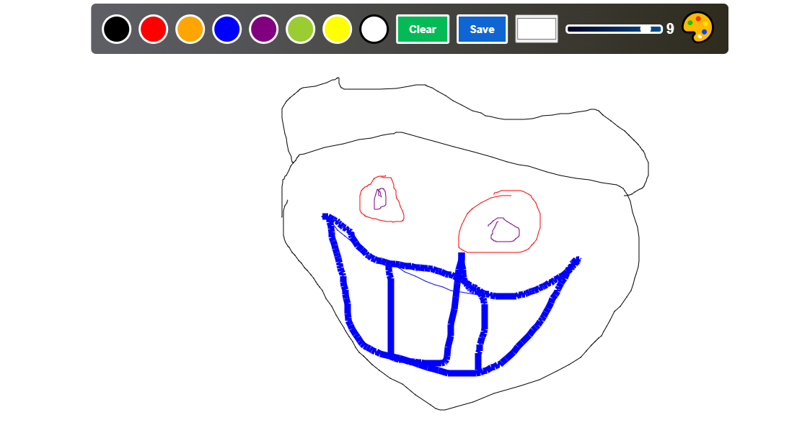

# Quick Sketch - Interactive Drawing Web App

Quick Sketch is a web application that allows users to create digital sketches using a simple and intuitive drawing interface. This project was developed as part of my studies at Kristu Jayanti College.

## Features

- **Drawing Canvas:** Use the HTML5 Canvas and JavaScript to draw freely on the web app.
- **Responsive Design:** The application is designed to work on various devices, including desktops, tablets, and smartphones.
- **Basic Tools:** Includes tools like pencil, eraser, and color selection for drawing.
- **Save and Share:** Users can save their drawings and share them with others.

## Tech Stack

- Frontend: HTML, CSS, JavaScript
- Tools: Visual Studio Code, Git

## Getting Started

To run this project locally, follow these steps:

1. Clone this repository:
   
  git clone https://github.com/Emmanuel301004/quicksketch.git '''

2. Open the project directory:
bash
Copy code
cd quicksketch
3.Open index.html in your web browser.

Links
app to download : Quick Sketch Web App https://drive.google.com/file/d/104j4wooT92bxDh4JRs54pCRwObJaSSAW/view?usp=drive_link
GitHub Repository: Quick Sketch on GitHub
Try it Online: Live Demo https://paint-app0.netlify.app
